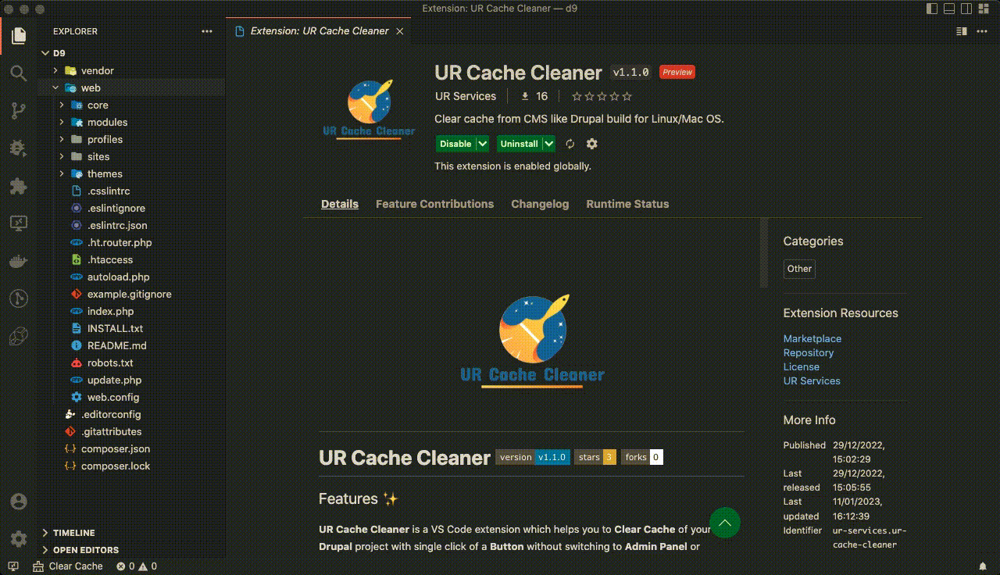

<h1 align="center">
   
    
   
</h1>

# **UR Cache Cleaner**   

## Features ✨

**UR Cache Cleaner** is a VS Code extension which helps you to **Clear Cache** of your **Drupal** project with single click of a **Button** without switching to **Admin Panel** or **Terminal** build for **Linux/Mac** OS.

### Shortcut keys

- Mac :- **⌘+C ⌘+R**
- Linux :- **Ctrl+C Ctrl+R**

For example if you open Drupal project, Then you can see the **Clear Cache** button at the left side of **Status Bar** :

---

## Known Issues

- This extension can't be use on windows system.

Feel free to add any issues under our [repository](https://github.com/vinugawade/ur-cache-cleaner/issues).

---

## Changelog

See [CHANGELOG.md](CHANGELOG.md).

---

## Release Notes

### 1.0.0

Initial release for **Clear Cache** of **Drupal** projects on **Linux/Mac** OS.

---

## Contributors ✨

Feel free to contribute in our [repository](https://github.com/vinugawade/ur-cache-cleaner).

---

## Credits ✨

- Logo generated by [DesignEvo](https://www.designevo.com) free logo designer.
- Icons added by [glyphter](https://glyphter.com/) free icon font pack.

---

## Maintainer ✨

Built with 💛 by [Vinay Gawade](https://github.com/vinugawade).

---

## License

See [LICENSE](LICENSE).

