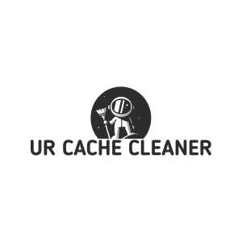

<h1 align="center">
  <br>
    
  <br>
</h1>

# **UR Cache Cleaner**   

## Features ✨

**UR Cache Cleaner** is a powerful VS Code extension designed specifically for drupal projects. It offers the following features:

- **Cache Clearing:** With just a single click of a button, you can easily clear the cache of your Drupal/CiviCRM project without the need to switch to the admin panel or terminal.

- **Efficiency:** UR Cache Cleaner streamlines the cache clearing process, saving you time and effort by eliminating the need to navigate through different panels or tools.

- **User-Friendly Interface:** The extension provides a clean and intuitive interface, making it easy for users to navigate and utilize its features.

- **Linux/Mac OS Support:** UR Cache Cleaner is specially built to cater to Linux and Mac OS users, ensuring optimal performance on these platforms.

Experience the convenience and efficiency of **UR Cache Cleaner** in managing cache clearing for your drupal projects. Upgrade your workflow and enhance productivity with this powerful VS Code extension.


### Shortcut keys ✨

> Drupal Cache Clear

- Mac: **⇧+⌘+C, ⇧+⌘+R**
- Linux: **Ctrl+Shift+C, Ctrl+Shift+R**

> CiviCRM Cache Clear

- Mac: **⇧+⌘+C, ⇧+⌘+C**
- Linux: **Ctrl+Shift+C, Ctrl+Shift+C**

When you open a `Drupal` project, you will find the `Clear Cache` & `CiviCRM Clear Cache` button located on the **Bottom-Left** side of the Status Bar.


## Requirements ✨

To utilize UR Cache Cleaner, please ensure you have installed below packages/tools in your project.
> Drush (Drupal)

```shell
composer require drush/drush
```

> CV (CiviCRM)

```shell
composer require civicrm/cli-tools
```


## Known Issues ✨

Please note that UR Cache Cleaner is not currently compatible with Windows OS. We apologize for any inconvenience this may cause.

We encourage you to report any issues you encounter on our [repository](https://github.com/vinugawade/ur-cache-cleaner/issues). Your feedback and contributions are highly appreciated.


## Changelog ✨

See [CHANGELOG.md](CHANGELOG.md).


## Contributors ✨

We welcome contributions to our [repository](https://github.com/vinugawade/ur-cache-cleaner). Feel free to contribute and help make **UR Cache Cleaner** even better.


## Maintainer ✨

**UR Cache Cleaner** is built with 💛 by [Vinay Gawade](https://vinay.is-a.dev).

Our **UR Cache Cleaner** [landing page](https://ucc.vinux.in) is built with 💛 by [Preeti Yadav](https://www.linkedin.com/in/preeti-yadav5443).

Your support and feedback are valuable in maintaining and improving the extension.

<a href="https://www.linkedin.com/in/vinu-gawade" target="_blank"></a>
<a href="https://www.buymeacoffee.com/vinaygawade" target="_blank"></a>
<a href="https://twitter.com/VinuGawade" target="_blank"></a>

<a href="https://www.buymeacoffee.com/vinaygawade" target="_blank"></a>


## Credits ✨

The logo for **UR Cache Cleaner** was generated using the free logo designer [Renderforest](https://www.renderforest.com), while the icons pack created by [glyphter](https://glyphter.com/), a free icon font pack.


## License ✨

Please refer to the [LICENSE](LICENSE) file for details on the licensing of **UR Cache Cleaner**.


