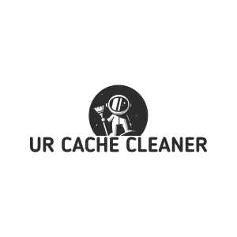

<h1 align="center">
   
    
   
</h1>

# UR Cache Cleaner

`UR Cache Cleaner` is a VS Code extension which helps you to clear your `CMS(Drupal)` project's `Cache` with single click of a `Button` without switching to `Admin Panel` or `Terminal`.

## Features ✨

Describe specific features of your enxtension including screenshots of your extension in action. Image paths are relative to this README file.

For example if there is an image subfolder under your extension project workspace:

---

## Known Issues

Feel free to add any issues under our [repository](https://github.com/vinugawade/ur-cache-cleaner/issues).

---

## Changelog

See [CHANGELOG.md](CHANGELOG.md).

---

## Release Notes

### 1.0.0

Initial release for `Clear Cache` of `Drupal` projects.

---

## Contributors ✨

Feel free to contribute in our [repository](https://github.com/vinugawade/ur-cache-cleaner).

---

## Credits ✨

- Logo generated by [DesignEvo](https://www.designevo.com) free logo designer.
- Icons added by [glyphter](https://glyphter.com/) free icon font pack.

---

## License

See [LICENSE](LICENSE).

---

## Maintainer ✨

Built with 💛 by Vinay Gawade.

